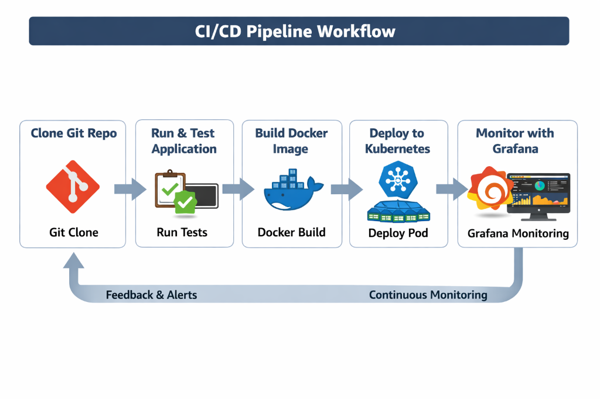
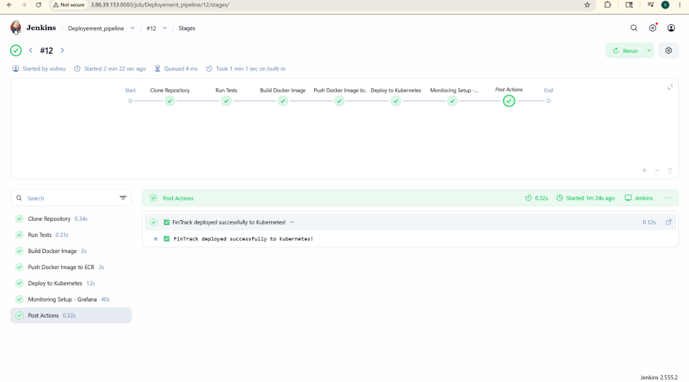

# 🚀 CI/CD Pipeline Workflow

This project demonstrates a complete CI/CD pipeline that automates the process from cloning a GitHub repository to deploying a containerized application on Kubernetes and monitoring it with Grafana.

---

## 📋 Pipeline Overview

1. **Clone GitHub Repository**
   - Pull source code from the remote repository.
   - Example:
     ```bash
     git clone https://github.com/<username>/<repo>.git
     cd <repo>
     ```

2. **Run & Test Application**
   - Install dependencies and run unit tests.
   - Example:
     ```bash
     npm install
     npm test
     ```

3. **Build Docker Image**
   - Create a Docker image for the application.
   - Example:
     ```bash
     docker build -t fintrack-app:latest .
     docker images
     ```

4. **Deploy to Kubernetes**
   - Push the Docker image to a registry (e.g., Docker Hub).
   - Create a Kubernetes Pod or Deployment.
   - Example:
     ```bash
     kubectl apply -f deployment.yaml
     kubectl get pods
     ```

5. **Monitor with Grafana**
   - Integrate Prometheus and Grafana for real-time monitoring.
   - Access Grafana dashboard:
     ```
     http://<EC2-Public-IP>:3000
     ```

---

## 🧩 Tools Used

| Stage | Tool |
|-------|------|
| Source Control | GitHub |
| Build & Test | Node.js / Python / Maven |
| Containerization | Docker |
| Orchestration | Kubernetes |
| Monitoring | Grafana + Prometheus |

---

## 📈 Flow Diagram



## 🏆 Pipeline Execution


